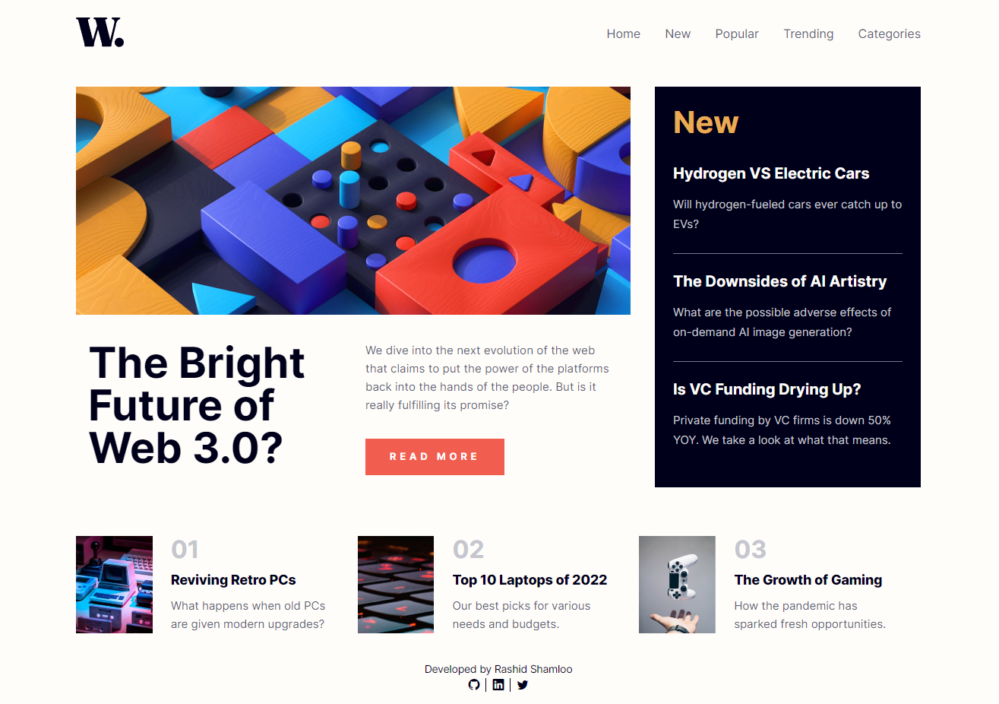
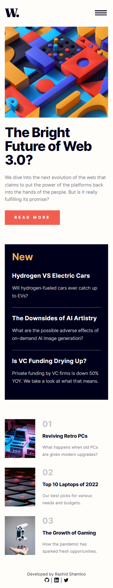

# Front End Mentor - Project 018 - News Homepage

This is a solution to the [Results Summary Component challenge on Frontend Mentor](https://www.frontendmentor.io/challenges/results-summary-component-CE_K6s0maV).

## Table of contents

- [Overview](#overview)
  - [Screenshot](#screenshot)
  - [Links](#links)
- [My process](#my-process)
  - [Built with](#built-with)
  - [What I learned](#what-i-learned)
  - [Useful resources](#useful-resources)
- [Author](#author)

## Overview

### Screenshot

- Desktop

- Mobile

### Links

- Solution URL: https://github.com/rashidshamloo/fem_018_news-homepage/
- Live Site URL: https://rashidshamloo.github.io/fem_018_news-homepage/

## My process

### Built with

- Semantic HTML5 markup
- Sass
- CSS Grid
- Vanilla JavaScript

### What I learned

- Implementing a responsive hamburger menu with CSS and JavaScript with animations
- Accessibility-related properties like "aria-expanded", "aria-controls", "role" etc.
- Using the "section" tag to mark different layout sections
- Using lists to show items instead of simple flex boxes

### Useful resources

- [Modern Normalize](https://github.com/sindresorhus/modern-normalize) - The CSS reset/normalize i used in this project

## Author

- Frontend Mentor - [@rashidshamloo](https://www.frontendmentor.io/profile/rashidshamloo)
- Twitter - [@rashidshamloo](https://www.twitter.com/rashidshamloo)
